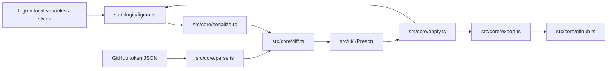

# アーキテクチャ概要

## 目的

このドキュメントは、コードベースを再読するときに「どこに責務があるか」を最短で把握するためのもの。

## 全体像

## モジュール責務

### core

- [src/core/types.ts](../src/core/types.ts)
  ドメイン型定義。差分種別や `SyncDocument` の正本。
- [src/core/document.ts](../src/core/document.ts)
  clone、slugify、reference 変換などの小さな共通関数。
- [src/core/hash.ts](../src/core/hash.ts)
  ハッシュ計算。
- [src/core/serialize.ts](../src/core/serialize.ts)
  Figma snapshot から `SyncDocument`、または `SyncDocument` から DTCG 互換の repo JSON を作る。
  出力時に mode ID → mode 名の変換と `$extensions.mode` の生成を行う。
- [src/core/parse.ts](../src/core/parse.ts)
  repo JSON から `SyncDocument` を作る。
  DTCG 形式（`$value` + `$extensions.mode`）と旧形式（mode ID 辞書の `$value`）の両方を読める。
- [src/core/diff.ts](../src/core/diff.ts)
  三方向比較と `create/update/delete/conflict` 判定。
- [src/core/apply.ts](../src/core/apply.ts)
  ユーザーが選んだ方向に応じて論理ドキュメントを変形する。
- [src/core/export.ts](../src/core/export.ts)
  PR に含めるファイルを絞り込み、repo 側 `syncedHash` を進める。
- [src/core/github.ts](../src/core/github.ts)
  GitHub API ラッパー。
- [src/core/selectors.ts](../src/core/selectors.ts)
  `SyncDocument` 検索ヘルパー。

### plugin

- [src/plugin/code.ts](../src/plugin/code.ts)
  plugin エントリポイント。runtime state、UI メッセージ処理、GitHub/Figma 呼び出しをまとめる。
- [src/plugin/figma.ts](../src/plugin/figma.ts)
  Figma Plugin API と `SyncDocument` の橋渡し。
- [src/plugin/storage.ts](../src/plugin/storage.ts)
  pluginData / clientStorage の読み書き。
- [src/plugin/request-queue.ts](../src/plugin/request-queue.ts)
  UI からのリクエスト逐次化。

### ui

Preact + TSX で構築。`@preact/signals` によるリアクティブなステート管理と仮想 DOM 差分更新を使用。

- [src/ui/ui.tsx](../src/ui/ui.tsx)
  エントリポイント。`render()` で Preact ルートコンポーネントをマウントし、plugin からのメッセージで signal を更新する。
- [src/ui/state.ts](../src/ui/state.ts)
  `@preact/signals` ベースのグローバルステート。`mergeState()` で plugin snapshot を反映し、signal 変更で参照コンポーネントだけが再描画される。
- [src/ui/messaging.ts](../src/ui/messaging.ts)
  `post()` 関数。UI → plugin へのメッセージ送信。
- [src/ui/resize.ts](../src/ui/resize.ts)
  ウィンドウリサイズのポインターイベント処理。
- [src/ui/components/App.tsx](../src/ui/components/App.tsx)
  ルートコンポーネント。`screen` signal に応じて MainScreen / ConfigScreen を切り替える。
- [src/ui/components/MainScreen.tsx](../src/ui/components/MainScreen.tsx)
  メイン画面。差分サマリー、警告一覧、差分テーブル、アクションボタンを含む。
- [src/ui/components/ConfigScreen.tsx](../src/ui/components/ConfigScreen.tsx)
  設定画面。GitHub 接続設定フォーム。
- [src/ui/components/StatusBar.tsx](../src/ui/components/StatusBar.tsx)
  ステータス表示バー。
- [src/ui/components/WarningList.tsx](../src/ui/components/WarningList.tsx)
  警告一覧。
- [src/ui/components/DiffTable.tsx](../src/ui/components/DiffTable.tsx)
  差分テーブル全体。値のフォーマットとルックアップもここに持つ。
- [src/ui/components/DiffRow.tsx](../src/ui/components/DiffRow.tsx)
  差分テーブルの1行。select の値変更が宣言的にバインドされる。
- [src/ui/default-resolution.ts](../src/ui/default-resolution.ts)
  差分ごとの初期選択。
- [src/ui/diff-status.ts](../src/ui/diff-status.ts)
  差分の表示文言。

## `SyncDocument` が中核

Figma 側も GitHub 側も、最終的には `SyncDocument` に正規化してから比較する。

つまり:

- Figma の読み取り仕様を変える
  [src/plugin/figma.ts](../src/plugin/figma.ts)
- repo JSON 仕様を変える
  [src/core/parse.ts](../src/core/parse.ts)
  [src/core/serialize.ts](../src/core/serialize.ts)
- 差分の意味を変える
  [src/core/diff.ts](../src/core/diff.ts)

という分離になっている。

## 主要フロー

### 1. 差分更新

1. [src/plugin/code.ts](../src/plugin/code.ts) が Figma を読む
2. 同時に GitHub から repo JSON を読む
3. 両者を `SyncDocument` に正規化する
4. `diffSyncDocuments()` で差分を作る
5. UI へ state を送る

### 2. GitHub へ export

1. Figma を読み直す
2. `buildPullRequestFiles()` で repo ファイルを作る
3. GitHub に branch / commit / PR を作る

補足:
PR 作成は同期完了ではない。詳細は [sync-spec.md](./sync-spec.md)。

### 3. Repo から import

1. GitHub を読み直す
2. `applySyncDocumentToFigma()` で Figma を create/update する
3. 再度 Figma を読み、diff を更新する

### 4. 選択適用

1. UI の `resolutions` を受け取る
2. `applyDiffSelections()` で論理ドキュメントを変形する
3. `repo-to-figma` があれば Figma に反映する
4. `figma-to-repo` があれば PR ファイルを作る

## 重要な制約

- `manifest.json` は `dist/` を読む
- UI 文言の変更でも `pnpm --filter @orca/token-bridge-figma build` が必要
- variable は collection 単位ファイル
- style は style type 単位ファイル
- collection default mode は Figma 側へ強制反映できない

## 迷ったときの見方

- 「正しい差分種別は何か」が迷う:
  [sync-spec.md](./sync-spec.md)
- 「どこに責務があるか」が迷う:
  このファイル
- 「どのテストを足すか」が迷う:
  [testing.md](./testing.md)
